# Concept Mastery Grader - RAG-Augmented Educational Evaluation Platform

A sophisticated AI-powered educational assessment system that combines Retrieval-Augmented Generation (RAG) with interactive Socratic dialogue for evaluating student understanding.

## 🎯 Overview

Concept Mastery Grader transforms traditional educational assessment by using advanced AI to engage students in meaningful conversations while automatically evaluating their conceptual understanding. The platform processes course materials, generates dynamic rubrics, and provides real-time feedback through intelligent dialogue.

## ✨ Key Features

### 🤖 AI-Powered Assessment Engine
- **RAG-based Evaluation**: Uses semantic similarity search with pgvector to retrieve relevant context
- **Socratic Dialogue**: Generates probing questions to assess deep understanding
- **Automatic Grading**: Evaluates responses against dynamically generated rubrics
- **Real-time Feedback**: Provides immediate, contextual feedback during conversations

### 📚 Intelligent Content Processing
- **PDF Ingestion**: Automated text extraction and semantic chunking
- **Summary Generation**: AI-powered course material summarization
- **Rubric Creation**: Automatic generation of assessment rubrics from content
- **Misconception Detection**: Identifies and tracks common student misconceptions

### 💬 Interactive Learning Interface
- **Real-time Chat**: Turbo Streams-powered conversation interface
- **Adaptive Questioning**: AI adjusts questions based on student responses
- **Progress Tracking**: Visual progress indicators and concept mastery tracking
- **Engagement Analytics**: Detailed insights into student engagement patterns

### 👩‍🏫 Instructor Dashboard
- **Conversation Management**: Review and analyze all student interactions
- **Performance Analytics**: Comprehensive reporting and trend analysis
- **Rubric Management**: Edit and refine assessment criteria
- **Misconception Patterns**: Track and address common learning gaps

## 🏗️ Technology Stack

- **Backend**: Rails 8.1.1 with Turbo Streams and Stimulus
- **Database**: PostgreSQL 14+ with pgvector extension for vector similarity search
- **AI/LLM**: ruby_llm 1.9 with support for OpenAI, Anthropic, and Google AI
- **Background Jobs**: Sidekiq with Redis for queue management  
- **Styling**: TailwindCSS with responsive design
- **File Storage**: ActiveStorage with cloud storage support

## 🔄 System Architecture & Workflow

## Simple Architecture Diagram

```mermaid
flowchart LR

A[PDFs] --> B[Preprocessing\nExtract • Chunk • Embed] --> C[(Vector DB)]

C --> D["Summary Generator (RAG)"] --> E["Rubric Builder (RAG)"] --> F[Interactive Chatbot]
C <--> F

F --> G[Chat Transcript + Evidence Tags] --> H["Grader (RAG-Evidence Based)"]
C <--> H

H --> I[Final Grade Report]
```



## Detailed Architecture Diagram


### 📋 Workflow Breakdown

#### 1. **Document Ingestion Pipeline**
```
PDF Upload → Text Extraction → Semantic Chunking → Embedding Generation → Vector Storage
     ↓              ↓                ↓                    ↓                  ↓
ActiveStorage → pdf-reader → Smart Segmentation → LLM Embeddings → pgvector Database
```

#### 2. **AI Content Generation**
```
Course Material → Content Analysis → LLM Processing → Generated Content
      ↓               ↓                 ↓                 ↓
   Raw Text → Concept Extraction → Prompt Engineering → Summaries/Rubrics
```

#### 3. **Real-time Conversation Flow**
```
Student Message → Context Retrieval → AI Response Generation → Real-time Update
      ↓               ↓                      ↓                      ↓
   User Input → Vector Similarity → RAG + LLM Processing → Turbo Streams
```

#### 4. **Automatic Assessment Pipeline**
```
Conversation → Content Analysis → Rubric Evaluation → Grade Report Generation
     ↓              ↓                  ↓                    ↓
  Chat History → Pattern Recognition → AI Scoring → Detailed Feedback
```

#### 5. **Instructor Analytics Dashboard**
```
Raw Data → Statistical Analysis → Performance Metrics → Visual Dashboard
    ↓            ↓                     ↓                  ↓
Database → Aggregation Queries → Trend Analysis → Real-time Charts
```

## 🚀 Quick Start

### Prerequisites
- Ruby 3.4.3+
- Node.js 18+
- PostgreSQL 14+ with pgvector
- Redis 6+
- OpenAI API key

### Installation

1. **Clone and Setup**
```bash
git clone git@github.com:dhaneshnm/ConceptMasteryGrader.git
cd ConceptMasteryGrader
bundle install
npm install
```

2. **Environment Configuration**
```bash
cp .env.example .env
# Edit .env with your configuration
```

3. **Database Setup**
```bash
rails db:setup
rails db:migrate
```

4. **Start Services**
```bash
# Start Rails server
rails server

# Start Sidekiq (in another terminal)
bundle exec sidekiq
```

5. **Access Application**
- Web Interface: http://localhost:3000
- Instructor Dashboard: http://localhost:3000/instructor/dashboard

## 📈 Complete Implementation

This project represents a fully implemented RAG-augmented educational evaluation platform with:

✅ **Rails 8.1.1 Application** with modern architecture
✅ **Complete Domain Models** with proper associations and validations
✅ **PDF Processing Pipeline** with chunking and embedding generation
✅ **RAG Summary Generator** for course material analysis
✅ **RAG Rubric Builder** for automatic assessment criteria
✅ **Interactive Chat Interface** with Turbo Streams and Stimulus
✅ **RAG-based Evaluator Service** with semantic similarity search
✅ **Automatic Grading Engine** with detailed feedback reports
✅ **Instructor Dashboard** for comprehensive course management
✅ **Production Deployment Configuration** with Docker and deployment guides

## 🔒 Security & Performance

- **Vector Similarity Search**: Sub-100ms queries with pgvector
- **Real-time Updates**: Turbo Streams for instant UI updates
- **Background Processing**: Scalable job processing with Sidekiq
- **Production Ready**: Complete deployment configuration and monitoring

## 📞 Support

For deployment instructions, see [DEPLOYMENT.md](DEPLOYMENT.md)

Built with Rails 8.1.1, ruby_llm 1.9, and modern web technologies.
